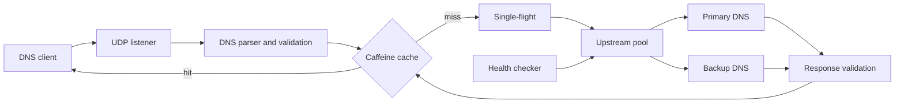

# DnsLB4J

A high-performance, non-blocking DNS proxy built with Java 21, Netty 4.2, and Caffeine. The server accepts UDP queries, forwards them to primary or backup DNS servers, validates responses, and caches them according to DNS TTL values.

## Key Features

- non-blocking request processing with Netty;
- per-core UDP listeners using `epoll` and `SO_REUSEPORT` on Linux;
- portable NIO fallback for Windows and macOS;
- primary and backup upstream DNS servers with automatic failover;
- active and passive health checks;
- bounded in-flight requests and duplicate-query coalescing with single-flight;
- Caffeine cache with size limits, DNS TTL expiration, and TTL aging;
- aggregated metrics without per-request logging.

## Technology Stack

- **Java 21** — records, modern language features, and current JVM runtime;
- **Netty 4.2** — asynchronous event-driven networking and UDP pipelines;
- **Java NIO, Linux epoll, and SO_REUSEPORT** — scalable per-core network I/O;
- **Caffeine** — memory-bounded and TTL-aware DNS response caching;
- **Gradle Kotlin DSL** — reproducible builds, testing, and application packaging;
- **JUnit 5** — unit and integration testing;
- **SLF4J and Logback** — structured application logging;
- **Git and Conventional Commits** — version control and structured history.

The project applies high-load backend practices such as non-blocking I/O, event loops, channel reuse, bounded in-flight requests, backpressure, single-flight query coalescing, active and passive health checks, automatic failover, graceful shutdown, and aggregated runtime metrics.

## Architecture



Request processing remains inside the event loop: the server does not create a thread per request or block Netty I/O threads. Each outgoing query receives an internal DNS ID used to correlate the upstream response with the waiting client. See the [architecture documentation](docs/ARCHITECTURE.md) for detailed design decisions and limitations.

## Project Structure

```text
src/main/java/com/snail/dnslb4j/
├── DnsServer.java              # application entry point and lifecycle
├── config/ServerConfig.java    # config.ini loading and validation
├── server/                     # UDP listeners and request-processing pipeline
├── upstream/                   # routing, failover, health checks, and correlation
├── dns/                        # DNS packet parsing, cache keys, and TTL model
├── cache/                      # Caffeine adapter for DNS responses
└── metrics/                    # aggregated runtime metrics

src/test/java/com/snail/dnslb4j/
├── config/                     # configuration tests
├── dns/                        # DNS wire-format tests
├── server/                     # proxy integration tests
└── upstream/                   # upstream selection tests

config/
├── development/                # local development configuration
├── testing/                    # test environment configuration
└── production/                 # production configuration

docs/ARCHITECTURE.md            # detailed diagrams and design decisions
build.gradle.kts                # Gradle build and dependencies
gradle/                         # Gradle Wrapper files
```

Key components:

- `DnsProxyServer` creates listeners and manages Netty resources;
- `DnsProxyHandler` receives client UDP packets;
- `DnsProxyService` coordinates parsing, caching, single-flight, and upstream calls;
- `UpstreamResolver` sends queries through long-lived UDP channels;
- `UpstreamPool` selects an available primary or backup server;
- `HealthChecker` periodically checks upstream availability;
- `DnsResponseCache` stores responses in Caffeine with weighted limits and TTL expiration.

## Requirements

- JDK 21 or newer;
- Linux is recommended for `epoll` and `SO_REUSEPORT`;
- no local Gradle installation is required because the Gradle Wrapper is included.

## Build

Linux/macOS:

```bash
./gradlew clean build
```

Windows:

```powershell
.\gradlew.bat clean build
```

Main artifacts:

- `build/libs/DnsLB4J-1.0-SNAPSHOT-jar-with-dependencies.jar`;
- `build/distributions/DnsLB4J-1.0-SNAPSHOT-package.zip`.

## Run

```bash
java -jar build/libs/DnsLB4J-1.0-SNAPSHOT-jar-with-dependencies.jar development
```

The `development` argument selects `config/development/config.ini`. The `testing` and `production` environments are available in the same way.

The main settings cover the listener address, I/O thread count, upstream DNS servers, timeouts, in-flight request limits, health checks, caching, and metrics.

## Current Limitations

- DNS over UDP is supported; DNS over TCP and TCP retry for responses with `TC=1` are not implemented yet;
- only positive responses are cached; RFC 2308 negative caching is not implemented;
- public deployments must be protected with firewall rules, ACLs, and rate limiting.
