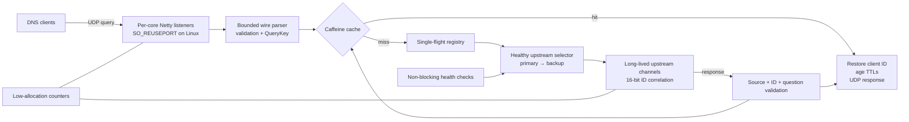

# Архитектура DnsLB4J

## Целевая схема

## Основные решения

- На запрос не создаются потоки, `EventLoopGroup`, сокеты или executors.
- Linux использует Netty epoll и несколько UDP listeners с `SO_REUSEPORT`; NIO остаётся переносимым fallback.
- Каждый listener работает с долгоживущим upstream-каналом. Запросы коррелируются новым 16-битным ID в bounded registry.
- Одинаковые cache miss объединяются single-flight механизмом, предотвращая DNS stampede.
- Caffeine ограничен по весу, использует variable expiry и хранит только heap `byte[]`, а не reference-counted `ByteBuf`.
- TTL каждого resource record уменьшается на время нахождения в кэше. TTL никогда не увеличивается выше значения upstream.
- Ответ принимается только от выбранного upstream и только при совпадении ID и DNS question.
- Основной и резервный pools переключаются по active/passive health state без fan-out на все узлы.
- Hot path не пишет INFO-лог на каждый пакет; состояние публикуется агрегированными метриками.

## Потоки

Netty event loops остаются platform threads: они выполняют короткую CPU-работу и неблокирующий I/O. Virtual threads Java 21 здесь не добавляют пропускной способности и не используются в data plane. Это соответствует reactor-подходу из статьи [How to Build a High-Performance TCP Server](https://www.chillvic.dev/p/how-to-build-a-high-performance-tcp).

## Ограничения текущей версии

- Data plane обслуживает DNS over UDP. DNS over TCP и UDP→TCP retry для ответов с `TC=1` должны добавляться отдельным transport-модулем.
- Кэшируются только успешные непрерывные ответы с положительным TTL. Negative caching намеренно не включён без полноценной RFC 2308 политики.
- Для публичного recursive resolver рекомендуется внешний firewall/ACL и response-rate limiting.
